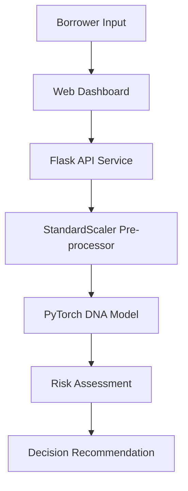

# GuardLink.ai | Loan Fraud Detection System


GuardLink is an enterprise-grade machine learning system designed to identify and mitigate loan application fraud. Utilizing a Deep Neural Network (DNN) architecture, it analyzes borrower attributes in real-time to provide high-precision risk assessments.

## 🚀 Key Features

- **Neural Decision Engine**: Multi-layer perceptron trained on historical credit data.
- **Enterprise Dashboard**: premium, responsive UI with real-time risk distribution charts.
- **Robust API**: RESTful endpoints with structured logging and CORS support.
- **Containerized Deployment**: Ready for production with Docker and Docker Compose.
- **Advanced Pre-processing**: Intelligent feature extraction and standardization.

## 🏗 System Architecture



## 🛠 Installation & Setup

### Local Development

1. **Install Dependencies**:
   ```bash
   pip install -r requirements.txt
   ```

2. **Train the Neural Model**:
   ```bash
   python train.py
   ```

3. **Launch the API Service**:
   ```bash
   python app.py
   ```

4. **Access the Dashboard**:
   Open `index.html` in your modern browser or serve via Nginx.

### Production (Docker)

```bash
docker-compose up --build
```
The API will be available at `localhost:5000` and the Dashboard at `localhost:80`.

## 📊 Feature Matrix

The model evaluates 12 critical financial dimensions:

| Dimension | Description |
|-----------|-------------|
| **Installment** | Calculated monthly payment amount |
| **Loan Amount** | Total principal requested |
| **Revolving Balance** | Total credit balance |
| **Delinquency** | Number of past-due incidents (2 years) |
| **Inquiries** | Recent hard credit inquiries (6 months) |
| **Mortgage** | Count of active mortgage accounts |
| **FICO High/Low** | Industry-standard credit score range |
| **Annual Income** | Total verified borrower income |

## 🛡 Security & Compliance

GuardLink implements enterprise security standards:
- **Input Validation**: Sanitized features before neural processing.
- **Structured Logging**: Complete audit trail for every prediction.
- **Error Handling**: Graceful failure modes for model inconsistencies.

---
© 2026 GuardLink Enterprise Solutions. All rights reserved.